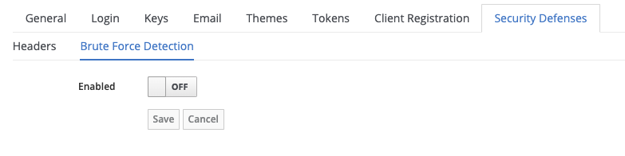
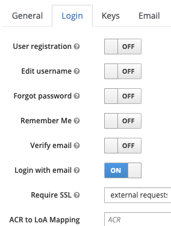
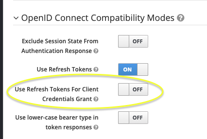
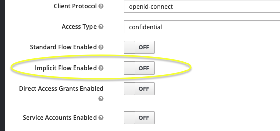
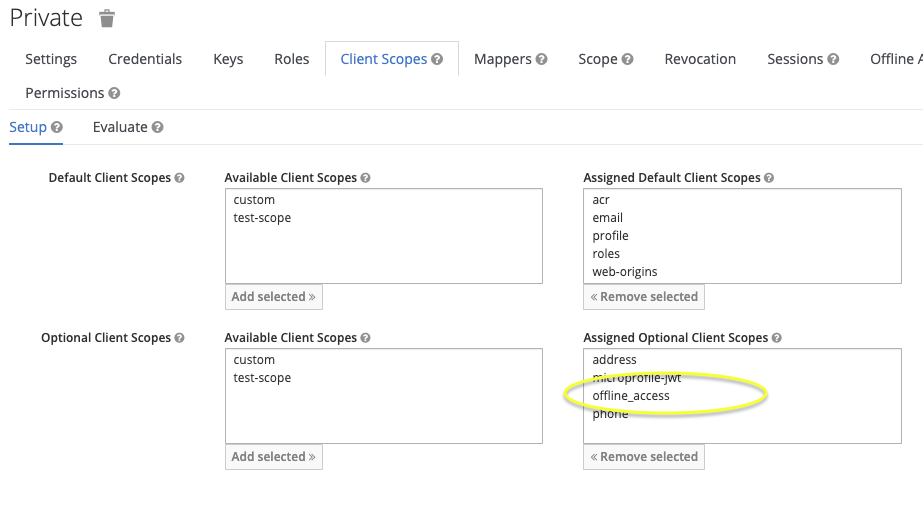
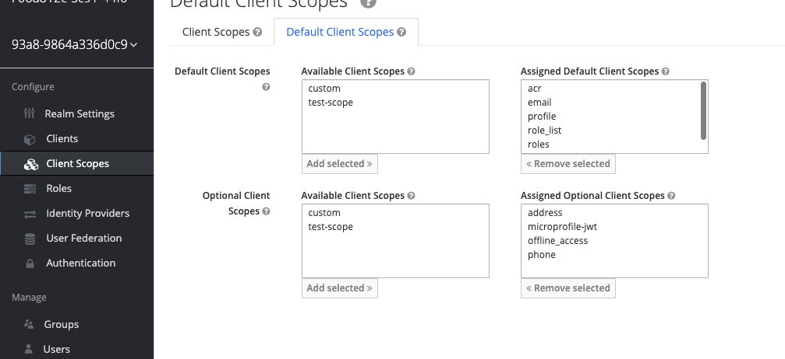
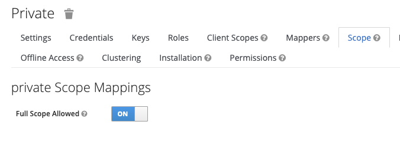
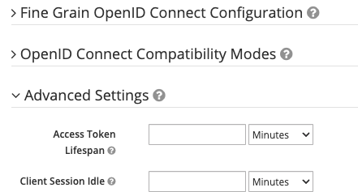

# Please-open.it Keycloak config checker

### Build

Use with Maven (>3) and JDK (>= 11).

```
mvn clean install
```

Copy deployments/config-checker.jar to /providers/ directory in Keycloak.

### Usage

**For each realm** 

#### Prometheus endpoints

Returns a single metric, the number of times the problem occurs. **best performance on those endpoints, use them for an automatic checker such as prometheus**.


- /realms/master/config-checker/realm/check
  - brute_force_disabled
  - reset_password_and_verify_email_and_login_with_email
  - reset_password_and_email_server
  - access_token_lifespan_is_too_long
  - events_are_saved
  - default_role_offline_access

- /realms/master/config-checker/clients/check
  - clients_with_refresh_token_on_client_credentials
  - implicit_flow_enabled
  - direct_access_grant_enabled
  - bad_redirect_uri
  - scope_offline
  - full_scope_allowed_and_scope_roles
  - access_token_lifespan_too_long
  - roles_scope_as_default
  - offline_scope_as_default

- /realms/master/config-checker/users/check
  - users_with_offline_access
  - users_with_admin_role_on_master
  - users_with_realm_management

#### Details endpoints 

- /realms/master/config-checker/realm/check/details
- /realms/master/config-checker/clients/check/details
- /realms/master/config-checker/users/check/details

**Those endpoints show all details. Less performance than metrics.**

#### Authentication

Those endpoints needs an access_token with "metrics" or "details" roles on a client named "configchecker" on each realm. It supports client_credentials also with those roles.

## Realm settings

### Brute force

Brute force is disabled.



### Reset password, verify email, login with email

Verify email is disabled, and also login with email or reset password is enabed.



### Reset password and email server

Reset password is enabled without a mail server configured.

### Access_token lifespan

Access_token lifespan is too high.

### Check events

Events are saved, this is not recommended for production.

## Clients

### Refresh token on client credentials



This option is for compatibility reasons. A client credentials does not output any refresh token. By the way, no session is stored on Keycloak. If you enabled this option, it will creates a session for each client credentials operation.

### Implicit flow



Not recommended for use.

Must be enabled only for hybrid flow. 

### Bad redirect URI

Redirect URIs with *, localhost or http.

### Scope offline



By default, scope "offline_access" is optionnal on each new client. This enables offline sessions on the client.

https://www.janua.fr/offline-sessions-and-offline-tokens-within-keycloak/

To remove it as a default scope, go to client scopes then default client scopes



### Full scopes allowed and roles

Full scope allowed option combined to default scope roles.



This get all the roles of the user while authenticating the user on the client. With the roles scopes enabled as default, it will put all roles of the user in the token.

### Access token lifespan

Access_token lifespan is overwritten and has a too high value.



## Scopes

### Roles scope

roles scope is set as a default or optionnal scope for all clients.

### offline_access

offline_access scope is set as a default or optionnal scope for all clients.

## Users

### offline_access

Users that have the capability to have offline session.

### users with realm management roles

Users that are admin on the realm

### Users with realm management roles for other or multiple realms

Only from master realm export.

Check users that have multiple admin roles on realms.

### Users with realm management on master realm

Users that has all admin control.

